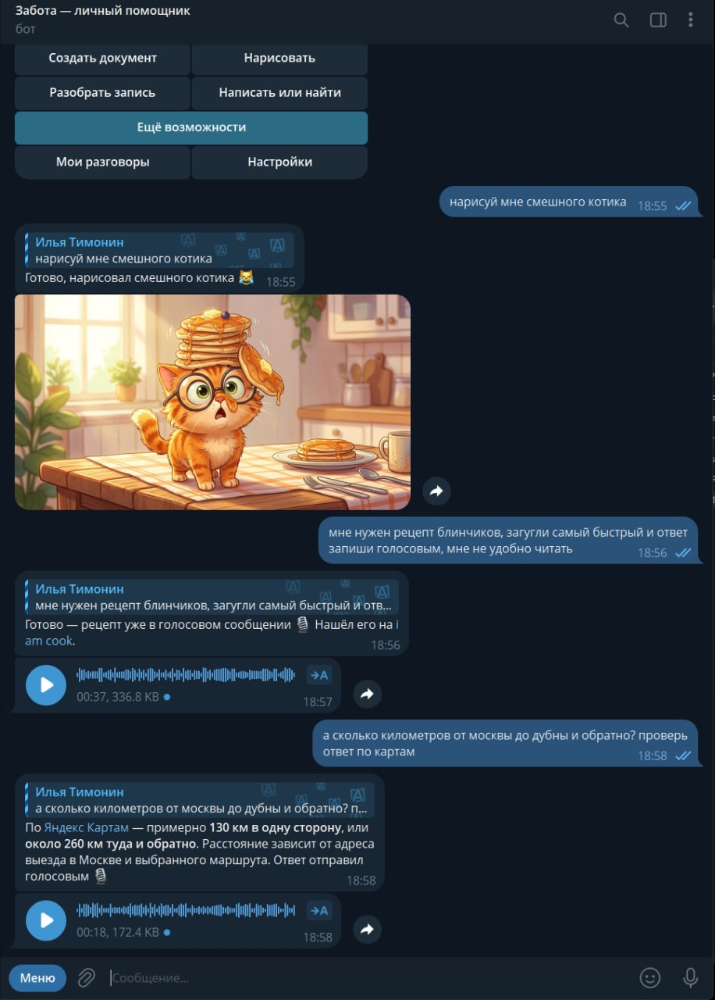

# Джарвис — Telegram-помощник на Codex

**Просто напишите, что хотите.** Текстом, голосом, картинкой или файлом. Официальный Codex выполняет задачу, OpenRouter даёт ему дополнительные инструменты, а результат приходит в Telegram.

[Скилл для установки с агентом](SKILL.md) · [Установка](docs/INSTALL.md) · [Что проверено](docs/STATUS.md) · [Безопасность](SECURITY.md)

<p align="center"></p>

*Реальный пример работы до переименования проекта в «Джарвис».*

## Что умеет

- Отвечать и выполнять составные просьбы, сохраняя контекст разговора.
- Создавать изображения и отправлять их прямо в чат.
- Искать информацию, в том числе через Perplexity Sonar, и отвечать голосовым сообщением.
- Распознавать голосовые; кружки, аудио и видео проходят через тот же обработчик речи.
- Работать с документами, таблицами, презентациями и PDF с помощью Python-библиотек.
- Показывать одну понятную карточку прогресса без shell-команд и технических идентификаторов.
- Сохранять задачи и результаты, восстанавливаться после перезапуска и предотвращать подтверждённые повторные доставки.

Это открытая основа собственного бота, а не облачный сервис с чужими ключами. Нужны свой Telegram-бот, доступ к официальному Codex, ключ и баланс OpenRouter, компьютер с WSL2 либо Linux VPS. OpenRouter оплачивается отдельно от подписки ChatGPT.

## Самый простой способ начать

Передайте своему агенту ссылку на этот репозиторий и напишите:

> Прочитай SKILL.md и установи мне такого бота. Сопровождай до рабочего результата: объясняй, где нажать и что подтвердить, самостоятельно выполняй доступные действия и помогай исправлять ошибки. Сначала получи текстовый ответ, затем подключи медиа и проверь восстановление задач. Я хочу запуск на WSL2 / Linux VPS.

[SKILL.md](SKILL.md) — полное задание установщику: от BotFather и входа в Codex до приёмки и дальнейшей помощи. Код уже лежит здесь; повторный поиск агентной платформы не нужен. Для регистрации как навыка Codex поместите файл в отдельную папку навыка под именем `SKILL.md` и передайте агенту путь к клону репозитория.

Для ручной установки используйте [пошаговую инструкцию](docs/INSTALL.md). Базовый путь установки — `/opt/jarvis`, отдельный Linux-пользователь — `jarvis`. WSL и VPS используют одинаковые systemd-сервисы. Видеокарта необязательна: есть CPU-профиль распознавания; CUDA устанавливается отдельно.

## Как устроено

```text
Telegram → Takopi → журнал задач → официальный Codex app-server
                                        ↓
                              клиент без API-ключа
                                        ↓
                              OpenRouter SDK worker
                                        ↓
                         файл / голосовое / текст в Telegram
```

Основной агент — Codex, а не OpenRouter. Базовая конфигурация использует `gpt-6-luna` с `medium`; установщик обязан проверить доступность модели в вашем аккаунте. Поддерживаемые AI-операции OpenRouter обнаруживаются через коннектор. Наличие метода не означает, что проверены все модели, кодеки и сценарии провайдера.

## Состав репозитория

| Путь | Содержимое |
|---|---|
| `src/takopi/` | Основа Takopi и доработки Джарвиса |
| `tests/` | Тесты моста, протокола, доставки и сохранности задач |
| `deploy/` | Стартовые скрипты, SDK-воркер, ASR и шаблоны сервисов |
| `tools/` | Клиент OpenRouter без секретов и инструкция агенту |
| `SKILL.md` | Сопровождаемая установка и полное ТЗ |
| `.env.example` | Пустой шаблон ключей, реальные значения вводятся локально |
| `docs/` | Установка, эксплуатация и границы проверенного |

## Ограничения

Это ранний публичный выпуск рабочего прототипа. Перед доступом незнакомых людей проверьте sandbox и разделение данных на своей машине. Каталоги разговоров и файловые ограничения не являются отдельными контейнерами для каждого пользователя.

Профиль демонстрации допускает любой Telegram ID в личных сообщениях. Платные попытки OpenRouter ограничены общим `OPENROUTER_CALL_LIMIT=20`; после приёмки владелец должен сознательно выбрать рабочий лимит. Это число попыток за срок жизни журнала, не дневной бюджет. Не удаляйте журнал ради сброса лимита.

Видеогенерация и другие расширенные методы доступны через SDK, но полный цикл каждого из них отдельно не проверен. Напоминания, Google-интеграции, публикация сайтов и удалённый Windows в этот выпуск не входят. У Telegram есть лимиты размера файлов. При аварии в момент внешней отправки невозможно всегда доказать доставку: неопределённый платный запрос или файл не повторяется вслепую.

WSL требует включённого компьютера без сна. VPS работает независимо от домашнего компьютера. Перенос на VPS описан, но новый облачный сервер в рамках подготовки этого репозитория не разворачивался.

## Благодарности и лицензия

Основано на [Takopi](https://github.com/banteg/takopi) 0.23.4, автор — banteg. MIT-лицензия и исходная атрибуция сохранены в [LICENSE](LICENSE). Публичный репозиторий содержит изменённый снимок исходников, а не историю локального рабочего каталога. Пакет и CLI сохраняют имя `takopi` для совместимости.

Дополнительные инструменты используют [официальный OpenRouter Python SDK](https://github.com/OpenRouterTeam/python-sdk). Codex, Telegram и OpenRouter — отдельные продукты со своими условиями доступа.
